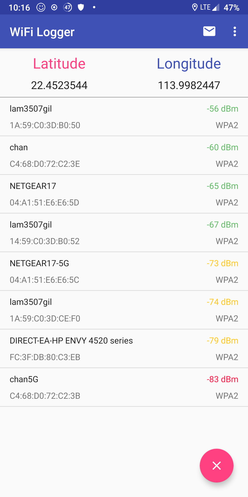

# WiFi Logger

An Android application uses to capture the Wi-Fi BSSID, Wi-Fi SSID, power and the current geographical location.

## Features

* Display current longitude and latitude
* Scan the Wi-Fi BSSID and SSID around
* Save the data logged to a JSON file or attach to an email
* Allow the user to control the frequency of scanning of Wi-Fi

## Getting Started

The following guide will help you download the project to the local machine, compile, and run it.

### Prerequisites

* Android Studio
* Android device / AVD

### Installing

1.  Clone or download the project as zip from GitHub.
2.  From the Android Studio menu click File > New > Import Project.
3.  Skip the Gradle update reminder.
4.  Install missing platform and sync project if prompt.
5.  Run.

## Screenshots

## Authors

* **Kiros Choi** - [KirosC](https://github.com/KirosC)

## Acknowledgement

* [gson](https://github.com/google/gson) - Conversion between Java Object and JSON
* [Guava](https://github.com/google/guava) - Core libraries
